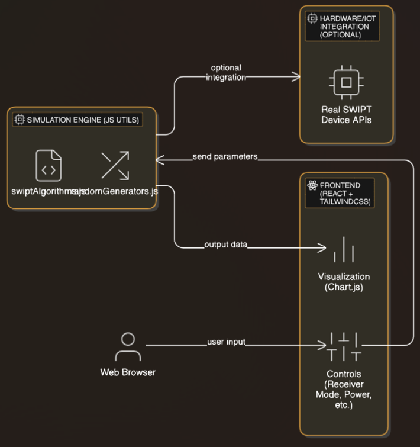

# SWIPT Data Center Simulator

A next-generation, interactive demonstration of **Simultaneous Wireless Information and Power Transfer (SWIPT)** for powering data centers.  
Designed for rapid, visually compelling demonstrations—ideal for investor presentations (e.g., TechCrunch C Series).


---

## 🚀 Why SWIPT for Data Centers?

- **Transformative:** Use wireless power transfer to reduce wiring, increase flexibility, and enable green energy solutions in large-scale data centers.
- **Interactive:** Show real-time trade-offs between energy harvesting and data rates with state-of-the-art simulation algorithms.
- **Pitch-Ready:** Built for high-stakes presentations—modern, fast UI and stunning visualizations.

---

## 🖥️ Features

- **Sleek, Responsive UI:** Modern, mobile-friendly interface using React and TailwindCSS.
- **Realistic Simulation:** Custom random data generators (normal, Poisson, uniform, exponential) model real-world wireless channel behaviors.
- **Interactive Controls:** Adjust parameters like power, data rate, receiver mode, and instantly see the impact.
- **Advanced Visualization:** Responsive, animated charts for instant feedback.
- **Extensible:** Ready to connect to real hardware or extend to more complex scenarios.

---

## 🛠️ Quick Start

```bash
git clone https://github.com/your-org/swipt-demo.git
cd swipt-demo
npm install
npm start
```

Open [http://localhost:3000](http://localhost:3000).

---

## 📊 Simulation Details

- **Receiver Modes:** Power-Splitting, Time-Switching
- **Parameters:** Input Power (W), Data Rate (Mbps), Random Distribution
- **Random Generators:** Normal, Uniform, Poisson, Exponential
- **Visualization:** Chart.js (react-chartjs-2)

---

## 📈 Example Scenario

> Set input power to 500W, use Poisson distribution—observe how harvested energy fluctuates while maintaining a data rate for seamless data center operations.

---

## 📚 Documentation

- [Full Documentation](docs/index.md)
- [Architecture Diagram](docs/architecture.png)
- [Usage Guide](docs/usage.md)

---

## 👩‍💻 Authors & Contact

- Lalroshan590 ([GitHub](https://github.com/lalroshan590))
- For partnership, demo, or funding inquiries: [Contact Us](mailto:lalroshan@akshayvj.com)

---

## Contributing

Pull requests are welcome! for major changes, please open an issue first to discuss what you would like to change.

---

## License 

© 2025 Akshay AGI LLP. All rights reserved.
