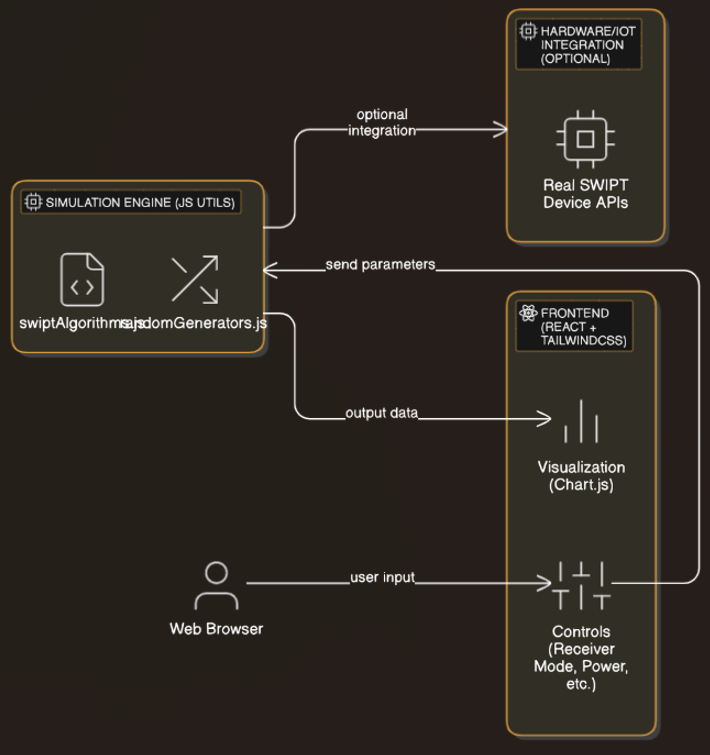

# SWIPT Data Center Simulator — Documentation

## Overview

**SWIPT (Simultaneous Wireless Information and Power Transfer)** is a breakthrough technology enabling wireless delivery of both energy and information—perfect for powering next-generation data centers.

This simulator demonstrates, in real-time, how SWIPT could revolutionize data center infrastructure.

---

## Architecture

### Components

- **Frontend:** React + TailwindCSS for a lightning-fast, modern UI
- **Simulation Engine:** Custom algorithms with advanced random data generation for realistic wireless channel modeling
- **Visualization:** Chart.js for animated, interactive feedback
- **(Optional) Hardware Interface:** Extensible to connect to real SWIPT receivers

---

## How it Works

1. **User sets parameters** (mode, power, data rate, distribution)
2. **Simulator generates channel samples** using random generators
3. **Results are visualized** in real-time, showing energy harvested and information rate
4. **Insights:** Users see trade-offs and potential for SWIPT-powered data centers

---

## Simulator Algorithms

- **Normal Distribution:** Models typical wireless noise
- **Uniform Distribution:** Simulates steady, predictable channels
- **Poisson Distribution:** For bursty, event-driven energy arrivals
- **Exponential Distribution:** For rare, high-impact channel conditions

All random generator code is modular and extendable for future hardware data integration.

## Simulator UI Screenshot

---

## Extending the Simulator

- **Connect to IoT hardware** for live SWIPT data
- **Add new algorithms** or receiver models via `/src/utils/`
- **Deploy to cloud** for public demos

---

## Usage Guide

See [usage.md](usage.md) for detailed instructions.

---

## Contact & Funding

Ready for C Series scaling.  
Contact: [hello@swipt-tech.com](mailto:hello@swipt-tech.com)

&copy; 2025 Akshay AGI LLP. All rights reserved.
